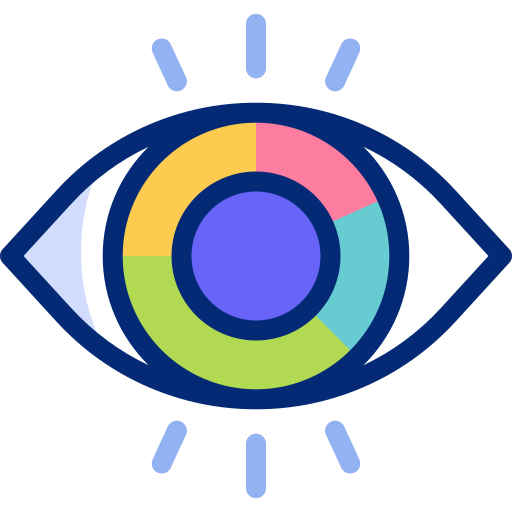

<h2>About me </h2>

    Hi! I’m a FullStack Web Developer, My goal is to put develop intelligent solutions aiming on effectiveness, agility and consistency, delivering the best of my capabilities.

<h2>Skills  </h2>

      
<b>Front-end</b>

    
    
    
    
    
           
    
    
    

<b>Back-end</b>

    
    
    
    
    
    

 
<b>Databases</b>

        
    
    

<b>Tools</b>

    
    
    
    
    
    

<b>Other</b>

        
    
    
            
    

<b>OS</b>

    
    

<h2>Statistics </h2>

    
    

<h2>Reach me </h2>

    
    
    

